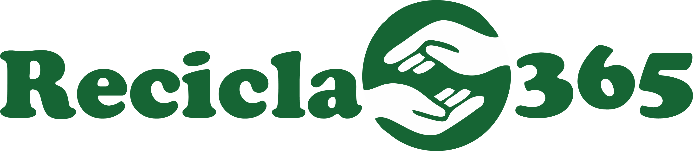

# 🌱 Recicla365

<div align="center">



**Plataforma de Gerenciamento de Resíduos e Pontos de Coleta**

[](https://reactjs.org/)
[](https://www.typescriptlang.org/)
[](https://vitejs.dev/)

[🚀 Ver Demonstração](https://recicla365-zeta.vercel.app)

</div>

---

## 📋 Sobre o Projeto

O **Recicla365** é uma plataforma inovadora que facilita o gerenciamento de resíduos e o acesso a pontos de coleta de materiais recicláveis em Santa Catarina. Nossa missão é conectar usuários conscientes com locais de reciclagem, promovendo sustentabilidade e responsabilidade ambiental.

### 🎯 Problema que Resolve

- **Dificuldade de localização**: Muitas pessoas não sabem onde descartar adequadamente diferentes tipos de resíduos
- **Falta de informação**: Ausência de dados centralizados sobre pontos de coleta e materiais aceitos
- **Impacto ambiental**: Reduzir o descarte inadequado e aumentar as taxas de reciclagem
- **Conscientização**: Educar a população sobre a importância da reciclagem

### ✨ Funcionalidades Principais

- 🔐 **Sistema de Autenticação** - Cadastro e login seguro de usuários
- 📊 **Dashboard Inteligente** - Visão geral com estatísticas em tempo real
- 📍 **Cadastro de Pontos** - Registre novos locais de coleta com integração ao ViaCEP
- 🗂️ **Gerenciamento Completo** - Liste, edite e remova pontos de coleta
- 🌙 **Tema Dinâmico** - Alternância entre modo claro e escuro
- 📱 **Design Responsivo** - Experiência otimizada para todos os dispositivos

---

## 🛠️ Stack Tecnológica

### **Frontend**
```json
{
  "framework": "React 19.1.0",
  "linguagem": "TypeScript 5.8.3",
  "bundler": "Vite 6.3.5",
  "roteamento": "React Router DOM 7.6.2",
  "estilização": "CSS3 com variáveis CSS",
  "arquitetura": "Atomic Design",
  "gerenciamento_estado": "Context API + Hooks"
}
```

### **Ferramentas de Desenvolvimento**
- **ESLint** - Análise estática de código
- **TypeScript** - Tipagem estática
- **Vite** - Build tool ultra-rápida
- **Git** - Controle de versão

### **APIs Integradas**
- **ViaCEP** - Consulta de endereços via CEP
- **LocalStorage** - Persistência local de dados

### **Arquitetura do Projeto**

```
src/
├── components/           # Componentes organizados em Atomic Design
│   ├── atoms/            # Elementos básicos (Button, Icon, Input, LoadingSpinner, SuccessNotification, Typography)
│   ├── molecules/        # Combinações de atoms (Card, CepInput, FormField, FormProgress, LocationActions, SearchBox)
│   ├── organisms/        # Seções complexas (CollectionPointForm, CollectionPointsList, CollectionPointViewModal, ConfirmDeleteModal, DashboardStats, Header, LoginForm, Navigation, ProfileForm, RegisterForm)
│   └── templates/        # Layouts de página (AuthTemplate, DashboardTemplate, NotFoundTemplate)
├── pages/                # Páginas da aplicação
│   ├── Login/            # Autenticação
│   ├── Register/         # Cadastro de Usuário
│   ├── Dashboard/        # Painel principal
│   ├── LocaisColeta/     # Gestão de pontos de coleta
│   ├── CadastroLocal/    # Cadastro de Pontos de Coleta
│   └── Perfil/           # Gestão de dados do Usuário
├── contexts/             # Context API para estado global
│   ├── AuthContext.tsx   # Autenticação de usuários
│   └── ThemeContext.tsx  # Tema claro/escuro
├── types/                # Definições TypeScript
├── styles/               # Estilos globais e variáveis CSS
├── hooks/                # Custom Hooks para lógica reutilizável
├── services/             # Camada de serviços e APIs
├── utils/                # Funções utilitárias
└── data/                 # Dados fictícios para desenvolvimento
```

---

## 🚀 Começando

### **Pré-requisitos**

Certifique-se de ter instalado:
- [Node.js](https://nodejs.org/) (versão 18 ou superior)
- [npm](https://www.npmjs.com/) ou [yarn](https://yarnpkg.com/)
- [Git](https://git-scm.com/)

### **Instalação**

1. **Clone o repositório**
```bash
git clone https://github.com/danitavareslobo/Recicla365.git
cd Recicla365
```

2. **Instale as dependências**
```bash
npm install
# ou
yarn install
```

3. **Inicie o servidor de desenvolvimento**
```bash
npm run dev
# ou
yarn dev
```

4. **Acesse a aplicação**
```
http://localhost:5173
```

### **Scripts Disponíveis**

```bash
npm run dev      # Inicia servidor de desenvolvimento
npm run build    # Gera build de produção
npm run preview  # Visualiza build de produção
npm run lint     # Executa ESLint
```

---

## 📖 Como Usar

### **1. Primeiro Acesso**
- Acesse a tela de login
- Clique em "Cadastrar" para criar uma nova conta
- Preencha todos os campos obrigatórios
- Faça login com suas credenciais

### **2. Dashboard**
- Visualize estatísticas em tempo real
- Acompanhe métricas de usuários ativos
- Veja pontos de coleta cadastrados
- Monitore impacto ecológico estimado

### **3. Gerenciar Pontos de Coleta**
- Navegue para "Pontos de Coleta"
- Cadastre novos locais clicando em "Novo Ponto"
- Use o CEP para preenchimento automático do endereço
- Selecione os tipos de materiais aceitos
- Edite ou remova pontos existentes

### **4. Personalização**
- Alterne entre tema claro e escuro
- Interface responsiva para todos os dispositivos

---

## 🌳 Metodologia de Desenvolvimento

### **Branchs**

Seguimos uma estratégia organizada de branches para cada funcionalidade:

```
main                         # 🚀 Branch principal (produção estável)
├── develop                  # 🔄 Branch de desenvolvimento (integração)
├── fix/teste-fluxo          # 🐛 Correções de fluxo e testes
├── fix/erros-build          # 🐞 Correções de erros do build
├── feat/perfil              # 👤 Funcionalidades do perfil de usuário
├── feat/componentes         # 🧩 Desenvolvimento de componentes base
├── feat/dashboard           # 📊 Painel principal com estatísticas
├── local-coleta             # 📍 Funcionalidades específicas de localização
├── feat/login               # 🔐 Sistema de autenticação
├── feat/cadastro-usuario    # 📝 Cadastro e gestão de usuários
├── feat/templates           # 🎨 Templates e layouts da aplicação
└── feat/estilos             # 💅 Sistema de estilos e temas
```


---


## 🔄 Idéias para Melhorias Futuras

- [ ] **Backend API** - Migração do localStorage para API REST
- [ ] **Mapa Interativo** - Visualização geográfica dos pontos
- [ ] **Notificações Push** - Alertas sobre novos pontos próximos
- [ ] **Relatórios** - Análises detalhadas de impacto ambiental
- [ ] **Compartilhamento Social** - Integração com redes sociais
- [ ] **Dashboard Analytics** - Métricas avançadas com gráficos

---

## 👨‍💻 Autor

**Daniele Tavares Lobo**
- GitHub: [@danitavareslobo](https://github.com/danitavareslobo)
- LinkedIn: [Daniele Tavares Lobo](https://linkedin.com/in/danitavareslobo)
- Email: danitavares.dev@gmail.com

---

<div align="center">

**Feito com 💚 para um futuro mais sustentável**

[⬆ Voltar ao topo](#-recicla365)

</div>